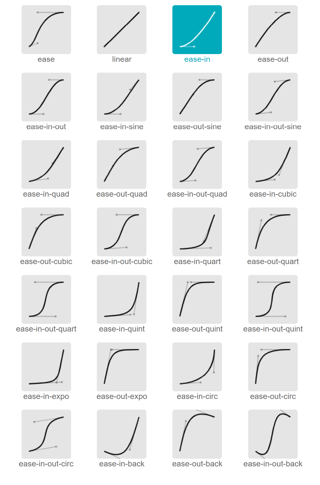

### 说明
方便在Android中使用Interpolator一些常见的CubicBezier贝塞尔曲线动画效果。

### 示意图如下


### 使用
1. 将 [CubicBezierInterpolators.kt](app/src/main/java/com/logan/cubicbezierandroidinterpolators/interpolators/CubicBezierInterpolators.kt) 类Copy到你项目中。

2. 使用如下：
```kotlin
val animator: ObjectAnimator = ObjectAnimator.ofFloat(yourView, "translationX", 0, 500)
animator.duration = 1000
animator.interpolator = CubicBezierInterpolators.Type.EASE.create()
animator.start()
```

### 如果网络访问github加载不出来图片效果，国内用户可以访问该地址： [https://blog.csdn.net/notwalnut/article/details/135999774](https://blog.csdn.net/notwalnut/article/details/135999774) 

### 如果你有任何疑问可以留言。
### 如果这篇文章对你有帮助，可以赏个star支持一下作者。

### DEMO
1. Demo.apk [点击下载](apk/app-debug.apk)
2. Demo的Gif效果图 

### 感谢
http://yisibl.github.io/cubic-bezier/#.25,.1,.25,1
